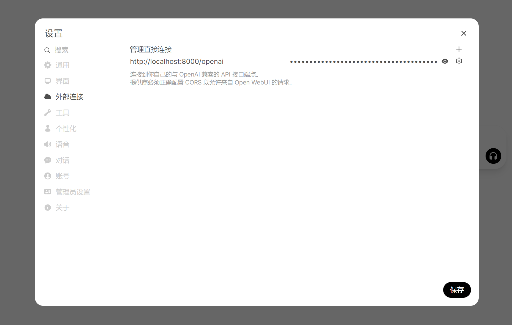

# 🎯 基于多Agent与GraphRAG的校园智能助手

## 📸 界面预览(移动端)


<div align="center">

<table>
  <tr>
    <td align="center">
      
      <p style="color: #666; font-size: 0.9em;">图1：系统主界面</p>
    </td>
    <td align="center">
      
      <p style="color: #666; font-size: 0.9em;">图2：问答展示1</p>
    </td>
    <td align="center">
      
      <p style="color: #666; font-size: 0.9em;">图3：问答展示2</p>
    </td>
    <td align="center">
      
      <p style="color: #666; font-size: 0.9em;">图4：问答展示3</p>
    </td>
  </tr>
</table>

</div>


## 📂 项目结构

```bash
YNU-Mind
├── README.md            # 项目文档
├── data/               # 数据爬取及处理模块
├── images/             # 项目图片资源
├── open-webui-main/    # 前端工程目录
│   └── backend/        # 前端服务端
└── ynu-assistant/      # 核心后端服务
    └── main.py         # 服务启动入口
```
# 🚀 快速开始
## 环境准备
- Neo4j neo4j-community-5.26.3
- Node.js v20.18.1
## 🛠️ 部署步骤

1. 克隆仓库
```bash
git clone https://github.com/Burning1020/YNU-Mind.git
cd YNU-Mind
```

2. 配置Neo4j数据库
```bash
# 在Neo4j bin 目录下双击cypher-shell.bat
# 输入以下命令创建数据库
source ./docs/all_2_.cypher
```
3. 环境变量
```bash
export OPENAI_API_KEY=your_api_key
export NEO4J_PASSWORD=your_password
```

4. 启动后端服务
```bash
cd ynu-assistant
pip install -r requirements.txt
python main.py
```
5. 配置前端服务端
```bash
cd ../open-webui-main/backend
pip install -r requirements.txt
./start_windows.bat  # Windows系统
# 或 ./start_linux.sh  # Linux系统
```
6. 启动前端界面
```bash
cd ..
npm install
npm run dev
```
# 🌐 访问系统
浏览器访问 http://localhost:5173

在设置页面中添加外部链接

